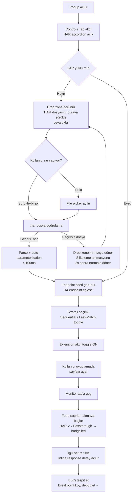
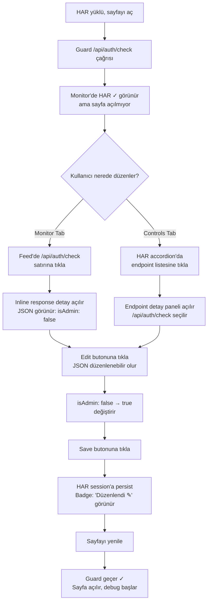
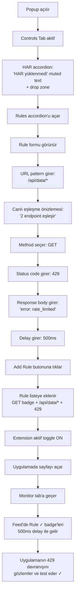
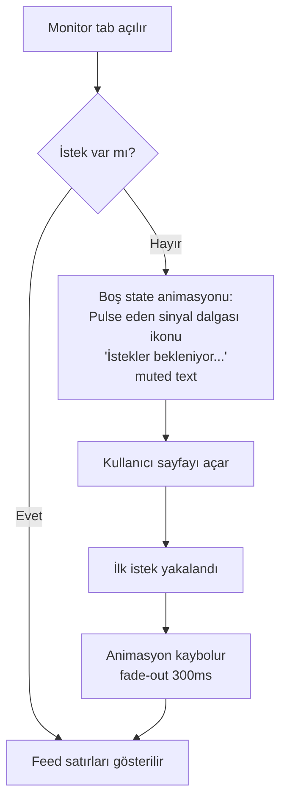

# UX Design Specification har-mock-plugin

**Author:** Berk
**Date:** 2026-02-21

---

## Executive Summary

### Project Vision

har-mock-plugin, frontend developer'ların production bug'larını local ortamda birebir reproduce etmesini sağlayan bir developer aracıdır. "HAR dosyasını at, gerisini araç halleder" vizyonuyla zero-config deneyim sunar. İki bağımsız bileşenden oluşur: tüm web uygulamalarında çalışan bir Chrome Extension ve Angular uygulamalarına native entegrasyon sağlayan bir Angular Plugin.

### Target Users

**Birincil Kullanıcı: "Debug Emre"**
- Mid-senior frontend developer, enterprise/büyük ekip projelerinde çalışıyor
- Prod ortamına doğrudan erişimi yok — HAR dosyası üzerinden debug yapıyor
- Teknik yetkinliği yüksek, yeni araçları hızla benimser
- Başarı tanımı: HAR'ı yükle → prod ekranı local'de aç → breakpoint koy → debug et
- Cihaz: Masaüstü (Chrome browser), geliştirme ortamında

### Key Design Challenges

- **Popup alan kısıtı:** Chrome Extension popup'ı sınırlı bir alan — HAR yükleme, mode seçimi, rule tanımlama, monitoring gibi çok sayıda özellik tek yüzeyde sunulmalı
- **Kavramsal netlik:** Sequential vs Last-Match mode farkı ilk kullanımda anlaşılabilir olmalı
- **Rule tanımlama karmaşıklığı:** URL pattern + method + status + body + delay — zengin form ama developer hız bekliyor, friction minimal olmalı
- **Response editing:** JSON editör deneyimi inline sunulmalı ama developer'ı akış dışına çıkarmamalı

### Design Opportunities

- **"Aha!" anını hızlandırma:** HAR yüklenip ilk request eşleştiğinde anında görsel feedback — developer'ın güvenini ilk 10 saniyede kazanma
- **Şeffaflık = güven:** "Acaba çalıştı mı?" sorusunu ortadan kaldırmak — her request'in akıbeti Monitor tab'ında anlık görünür
- **Zero-friction onboarding:** HAR sürükle-bırak → mode seç → bitir. 3 adımda debug oturumu
- **Progressive disclosure:** Controls tab'ında accordion ile karmaşıklık katmanlı açılır — ihtiyaç anında derinleş, geri kalan daraltılmış kalsın

### Popup Information Architecture

**Tasarım Kararı: Tab + Accordion Hibrit Yapısı**

Tüm Extension deneyimi popup içinde yaşar — sayfada ayrı overlay yok.

**Tab 1: Controls (Accordion yapısı)**
- **HAR Bölümü:** Drag & drop / file picker ile HAR yükleme, replay mode toggle (Sequential / Last-Match), HAR timing replay on/off
- **Rules Bölümü:** URL pattern + HTTP method + status code + response body + delay ile rule tanımlama; rule listesi (ekle/düzenle/sil)
- **Settings Bölümü:** Extension on/off toggle, exclude listesi yönetimi

**Tab 2: Monitor (Canlı request feed)**
- Her satırda: URL, HTTP method, eşleşme durumu ("Rule ✓" / "HAR ✓" / "Passthrough →")
- Satıra tıklayarak response görüntüleme ve inline edit
- Düzenlenen response HAR session'ına persist olur

**Karar gerekçesi:**
- Accordion: Developer sadece o an ihtiyaç duyduğu bölümü açar, popup alanı verimli kullanılır. Birden fazla bölüm aynı anda açık tutulabilir.
- Tab: Kontrol (ayarlama) ve izleme (monitoring) mental modelleri ayrışır. Developer niyetine göre tab seçer.
- Overlay yok: Sayfada görsel gürültü yok. Developer "ne oluyor?" diye merak ettiğinde popup → Monitor tab.

## Core User Experience

### Defining Experience

har-mock-plugin'in çekirdek deneyimi tek bir etkileşimde özetlenir:
**"HAR'ı sürükle-bırak yap → sayfayı aç → prod ekranını gör."**

Bu üç adımlık akış, tüm aracın değer kanıtıdır. Developer HAR dosyasını popup'a bıraktığı anda auto-parameterization devreye girer, URL pattern'ları oluşur ve intercept mekanizması aktif olur. Sayfayı açtığında prod state'inin birebir kopyasını local'de görür. Arada hiçbir konfigürasyon, handler yazımı veya endpoint tanımı yoktur.

Bu etkileşim doğru çalıştığında geri kalan her şey — rule tanımlama, response edit, exclude yönetimi — ek güç olarak kendini kanıtlar. Ama araç HAR yüklemesinde başarısız olursa, hiçbir şey kurtarmaz.

### Platform Strategy

- **Platform:** Chrome Extension (Chromium-based browsers)
- **Etkileşim:** Mouse/keyboard — masaüstü geliştirme ortamı
- **Ana yüzey:** Extension popup (tab + accordion hibrit yapısı)
- **Offline:** Gerekli değil — developer zaten local dev server'da çalışıyor
- **Platform avantajı:** Content script MAIN world'de fetch/XHR monkey-patching ile browser-native intercept — proxy kurulumu, ek yazılım veya framework bağımlılığı yok, Chrome MV3 ve Chrome Web Store uyumlu
- **Angular Plugin (MVP 2):** Code-first deneyim — provideHarMock() API, popup yok, tamamen programatik

### Effortless Interactions

**Refleks gibi çalışması gerekenler:**
- **HAR sürükle-bırak:** Dosyayı popup'a bırak, gerisini araç halleder. Parse, auto-parameterization, pattern oluşturma, intercept aktivasyonu — tamamı otomatik. Developer'ın tek eylemi dosyayı sürüklemek.
- **Auto-parameterization:** UUID, numeric ID, token segmentleri otomatik tespit edilir. Developer hiçbir URL pattern'ı elle tanımlamaz.
- **Default-On:** HAR yüklendiğinde tüm endpoint'ler aktif. Developer sadece istemediği endpoint'leri exclude eder — opt-out modeli.

**Mevcut araçların friction noktaları (ve har-mock-plugin'in çözdüğü):**
- MSW: Her endpoint için handler yaz → har-mock-plugin: HAR'ı at, bitti
- Charles Proxy: Masaüstü proxy kur, sertifika ayarla → har-mock-plugin: Extension kur, HAR sürükle
- Postman Mock: Endpoint'leri tek tek tanımla → har-mock-plugin: Tüm endpoint'ler otomatik

### Critical Success Moments

**Moment 1: "Aha!" Anı (Make-or-Break)**
Developer HAR'ı sürükle-bırak yapıp sayfayı açtığında, prod'daki ekranı birebir local'de görür. Bu an aracın tüm vaadini kanıtlar. Bu an başarısız olursa developer aracı terk eder.

**Moment 2: İlk Eşleşme Feedback'i**
HAR yüklendikten sonra developer sayfayı açtığında, Monitor tab'ında "HAR ✓" etiketleri akmaya başlar. Developer görür: "Evet, çalışıyor. Doğru URL'leri yakalıyor." Güven oluşur.

**Moment 3: Guard Edge Case Çözümü**
Developer guard'lı sayfada takılır → Monitor tab'ında response'u görür → inline edit ile isAdmin: true yapar → sayfa açılır. "Bu araç beni anlıyor" hissi.

**Moment 4: İlk Rule Tanımlama**
Developer HAR olmadan 500 error senaryosu test etmek ister → Rules accordion'unu açar → pattern + status + body yazar → çalışır. "HAR replay'den fazlası varmış" farkındalığı.

### Experience Principles

1. **HAR-First, Zero-Config:** Araç HAR dosyasından her şeyi çıkarır. Developer'a "şimdi şunu tanımla" demez. Varsayılan davranış: yükle ve çalışsın.

2. **Görünürlük = Güven:** Developer her zaman ne olduğunu bilir. Monitor tab'ı her request'in akıbetini şeffafça gösterir. "Acaba çalıştı mı?" sorusu asla sorulmaz.

3. **Progressive Complexity:** İlk deneyim 3 adım: HAR yükle → mode seç → sayfayı aç. Rule tanımlama, response edit, exclude yönetimi ihtiyaç anında keşfedilir. Araç basit başlar, ihtiyaçla derinleşir.

4. **Minimal Friction, Maksimal Kontrol:** Varsayılanlar akıllıdır (default-on, last-match mode, timing replay off). Ama developer istediği her şeyi değiştirebilir — kontrol her zaman developer'da.

## Desired Emotional Response

### Primary Emotional Goals

har-mock-plugin kullanıcıda üç temel duyguyu aynı anda, farklı anlarda yaratmalıdır:

1. **Güven & Kontrol:** "Her şeyi görüyorum, ne olduğunu biliyorum." Monitor tab'ındaki canlı feed, her request'in akıbetini şeffafça gösterir. Developer asla karanlıkta kalmaz.

2. **Sürpriz & Hayranlık:** "Bu kadar kolay mı ya?!" HAR'ı sürükle-bırak yaptıktan sonra sayfayı açtığında prod ekranını birebir görmesi — zero-config'in yarattığı "wow" anı.

3. **Verimlilik & Saygı:** "Bu araç benim zamanıma saygı duyuyor." Konfigürasyon yok, handler yazımı yok, proxy kurulumu yok. Developer'ın zamanı debug'a harcanır, setup'a değil.

**Paylaşma Motivasyonu:**
Developer aracı bir arkadaşına önerirken iki şeyi vurgular:
- "Çok esnek — HAR replay de yapıyor, rule-based mock da, response edit de"
- "Bug'ı %100 reproduce ediyor — artık 'bu bug'ı local'de göremiyorum' yok"

### Emotional Journey Mapping

| Aşama | Hedef Duygu | Tasarım Karşılığı |
|---|---|---|
| İlk keşif (Extension kurulumu) | Merak + umut | Chrome Web Store'da net değer önerisi |
| HAR yükleme | Kolaylık + rahatlama | Sürükle-bırak, anında parse feedback |
| Sayfayı açma ("Aha!" anı) | Sürpriz + hayranlık | Prod ekranı birebir local'de |
| Monitor tab'ını görme | Güven + kontrol | Canlı "HAR ✓" akışı |
| Response edit | Güçlülük + ustalık | Inline JSON edit, persist |
| Rule tanımlama | Keşif + esneklik | "HAR'dan fazlası varmış" |
| Hata durumu (parse fail, eşleşmeme) | Netlik + güven | Şeffaf hata mesajı, ne olduğu açık |
| Tekrar kullanım | Alışkanlık + güvenilirlik | "Her zaman çalışıyor" |

### Micro-Emotions

**Kritik duygusal çiftler ve hedefler:**

- **Güven > Şüphe:** Monitor tab her request'i gösterir. "Acaba çalıştı mı?" sorusu asla sorulmaz. Araç sessiz çalışmaz — her zaman hesap verir.
- **Verimlilik > Bezginlik:** MSW'de her endpoint için handler yazmak bezdirir. har-mock-plugin'de HAR'ı at, bitti. Setup zamanı saniyelerle ölçülür.
- **Rahatlama > Engellenmişlik:** Charles'ta proxy kur, sertifika ayarla, baştan başla. har-mock-plugin'de Extension kur, HAR sürükle — engel yok.
- **Ustalık > Çaresizlik:** Response edit ve rule tanımlama developer'a "ben bu aracın efendisiyim" hissi verir. Edge case'lerde bile çözüm developer'ın elinde.

### Design Implications

**Duygu → Tasarım Kararları:**

- **Güven yaratmak için:** Monitor tab'ında her request satırı "Rule ✓" / "HAR ✓" / "Passthrough →" etiketiyle. Hiçbir request sessizce geçmez. Hata mesajları şeffaf ve spesifik — "HAR parse hatası: satır 42'de geçersiz JSON" gibi.

- **Sürpriz yaratmak için:** HAR yüklendikten sonra Controls tab'ında başarı feedback'i — "12 endpoint eşleştirildi, intercept aktif" gibi anında sonuç. İlk sayfayı açtığında prod görüntüsü = "aha!" anı.

- **Verimlilik yaratmak için:** Varsayılanlar akıllı (default-on, last-match, timing off). Developer sadece istediğini değiştirir. Accordion kapalı başlar — ihtiyaç olan açılır, gürültü yok.

- **Esneklik hissettirmek için:** HAR replay + rule-based mock + response edit + exclude yönetimi — developer aynı araçla farklı senaryoları çözer. Araç tek boyutlu değil.

### Emotional Design Principles

1. **Şeffaflık Önce Gelir:** Araç sessiz çalışmaz. Her intercept, her eşleşme, her hata görünür olur. Developer'ın güveni şeffaflıktan doğar.

2. **Setup ≠ İş:** Developer'ın zamanı debug'a ayrılır, konfigürasyona değil. Aracın setup süresi saniyelerle ölçülmeli — dakikalar kabul edilemez.

3. **Hata = Rehber:** Bir şey ters gittiğinde araç ne olduğunu açıkça söyler. Developer sorunun ne olduğunu anlar ve kendi çözer. Araç engel olmaz, yol gösterir.

4. **Esneklik = Uzun Vadeli Benimseme:** Developer aracı sadece HAR replay için değil, rule-based mock, response edit ve error senaryosu testi için de kullanır. Tek araç, çok senaryo — bu esneklik developer'ı "toolkit'imin kalıcı parçası" noktasına taşır.

## UX Pattern Analysis & Inspiration

### Inspiring Products Analysis

**VS Code — Bilgi Sunuşu & Progressive Disclosure**

VS Code, developer araçları dünyasında bilgiyi sunuş biçimiyle altın standard oluşturur. har-mock-plugin için en değerli ilham kaynağı, VS Code'un progressive disclosure yaklaşımıdır:

- **Katmanlı karmaşıklık:** Explorer sidebar varsayılan açık, Extensions/Search/Source Control gizli. Developer ihtiyaç duydukça keşfeder. Hiçbir zaman "tüm özellikler ilk ekranda" olmaz — ama hepsi erişilebilir.
- **Panel sistemi:** Terminal, Problems, Output — farklı bilgi türleri farklı panellerde, tab ile geçiş. Developer bağlama göre panel seçer.
- **Inline feedback:** Error squiggly lines, hover tooltips, breadcrumb — bilgi bağlamında sunulur, developer'ı akışından çıkarmaz.
- **Status bar = anlık bağlam:** Encoding, satır, Git branch — bir bakışta anlaşılır, tıklanabilir ama bakmak bile yeterli.
- **Renk kodlama:** Kırmızı = hata, sarı = uyarı, mavi = bilgi. Evrensel, öğrenilmesi gerekmeyen görsel dil.

### Transferable UX Patterns

**1. Progressive Disclosure → Accordion Yapısı**
VS Code'un sidebar'ı nasıl sadece Explorer açık başlıyorsa, har-mock-plugin popup'ı da sadece HAR accordion'u açık başlar. Rules ve Settings kapalı — developer ihtiyaç duyduğunda açar. İlk deneyim sade, karmaşıklık katmanlı.

**2. Panel Sistemi → Controls + Monitor Tab**
VS Code'un Terminal/Problems/Output panel'leri gibi, har-mock-plugin'de Controls ve Monitor iki ayrı tab. Kontrol (ayarlama) ve izleme (monitoring) mental modelleri ayrışır. Developer niyetine göre tab seçer.

**3. Status Bar Felsefesi → Monitor Tab Satır Tasarımı**
VS Code status bar'daki "bir bakışta anlaşılır" prensibi Monitor tab'ına taşınır. Her request satırında: URL (kısaltılmış), method badge, eşleşme etiketi — developer tek satıra bakarak durumu anlar.

**4. Renk Kodlama → Eşleşme Etiketleri**
VS Code'un kırmızı/sarı/mavi renk dili, har-mock-plugin'de eşleşme durumuna uyarlanır:
- "Rule ✓" → mavi/mor (explicit tanım)
- "HAR ✓" → yeşil (başarılı eşleşme)
- "Passthrough →" → gri (gerçek API'ye geçti)
Renk = anlık anlama, etiket okumaya gerek kalmadan.

**5. Inline Feedback → HAR Yükleme Sonucu**
VS Code'un inline error gösterimi gibi, HAR yüklendiğinde Controls tab'ında anında feedback: "14 endpoint eşleştirildi, intercept aktif" — ayrı bir diyalog veya modal yok, bilgi yerinde.

### Anti-Patterns to Avoid

- **Bilgi bombardımanı:** Tüm özellikleri ilk ekranda gösterme. Developer "nereden başlayacağımı bilmiyorum" hissetmemeli. Accordion kapalı başlar.
- **Modal cehennem:** Her eylem için onay modal'ı açma. HAR yükleme, rule ekleme, response edit — hepsi inline ve akış içinde.
- **Gizli durum:** Aracın sessiz çalışması — MSW gibi "acaba aktif mi?" sorusu yaratma. Monitor tab her zaman şeffaf.
- **Jargon duvarı:** İlk kullanımda "auto-parameterization", "sequential mode" gibi terimlerle karşılamama. Terimler bağlamında, ihtiyaç anında öğrenilir.
- **Aşırı konfigürasyon:** İlk kullanımda seçenekler sunma. Varsayılanlar akıllı, developer sadece değiştirmek istediğini değiştirir.

### Design Inspiration Strategy

**Benimsenen Prensipler (VS Code'dan):**
- Progressive disclosure: Basit başla, ihtiyaçla derinleş
- Panel/tab ayrımı: Farklı niyet → farklı yüzey
- Renk kodlama: Anında anlam, okumaya gerek yok
- Inline feedback: Bilgi bağlamında, akışı bozmadan

**Uyarlanan Prensipler:**
- VS Code'un sidebar'ı her zaman görünür — popup sadece tıklanınca açılır. Bu yüzden popup açıldığında bilgi yoğunluğu daha kompakt olmalı.
- VS Code çok genel amaçlı — har-mock-plugin tek amaçlı. Bu avantaj: daha az öğrenme eğrisi, daha hızlı ustalık.

**Kaçınılan Yaklaşımlar:**
- Charles Proxy'nin masaüstü-ağırlıklı, kurulum-yoğun deneyimi
- MSW'nin "her şeyi kendin yaz" code-first-only yaklaşımı
- Postman'ın feature bloat'u — her özellik eşit derecede görünür

## Design System Foundation

### Design System Choice

**Tailwind CSS + Angular** — Utility-first CSS framework ile Angular-based Chrome Extension popup.

**Stack:**
- **UI Framework:** Angular (Extension popup'ı Angular ile yazılacak)
- **Stil Sistemi:** Tailwind CSS (utility-first, lightweight)
- **Görsel Dil:** Minimal / temiz — gereksiz dekorasyon yok, bilgi öncelikli

### Rationale for Selection

**Neden Tailwind CSS?**
- **Popup uyumu:** Chrome Extension popup'ının sınırlı alanında (≈400px genişlik) utility class'lar ile kompakt ve tutarlı stil. Ayrı CSS dosyaları şişmez.
- **Solo developer hızı:** Bileşen stilini HTML içinde yazarsın — CSS dosyaları arası geçiş yok, naming convention derdi yok.
- **Purge ile minimal bundle:** Kullanılmayan class'lar production build'den otomatik temizlenir — Extension boyutu küçük kalır.
- **Framework bağımsız:** Angular ile sorunsuz çalışır.

**Neden Angular?**
- **Tek dil, tek ekosistem:** Angular Plugin zaten Angular — Extension da Angular olursa tüm proje tek framework. Paylaşılabilir core logic.
- **Component-based:** Accordion, tab, feed satırı, JSON editor — her biri Angular component'i olarak izole ve test edilebilir.
- **Reactive forms:** Rule tanımlama formu (URL pattern + method + status + body + delay) Angular reactive forms ile temiz yönetilir.
- **Deneyim:** Berk'in Angular deneyimi var — öğrenme eğrisi yok.

**Neden Minimal/Temiz?**
- Developer aracı — dekorasyon değil bilgi önemli. Her piksel amaca hizmet eder.
- VS Code ilhamı: temiz tipografi, net renk kodlama, beyaz alan ile nefes.
- Güven hissini destekler: düzenli, profesyonel, "bu araç ciddi" izlenimi.

### Implementation Approach

**Tailwind Konfigürasyonu:**
- Özel renk paleti: eşleşme etiketleri için semantic renkler tanımlanır (HAR = yeşil, Rule = mavi/mor, Passthrough = gri, hata = kırmızı)
- Kompakt spacing scale: popup alanı için daha dar margin/padding değerleri
- Tipografi: mono font (URL'ler, JSON) + sans-serif (etiketler, başlıklar)

**Angular Bileşen Stratejisi:**
- `PopupComponent` → ana shell (tab bar + router outlet)
- `ControlsTabComponent` → accordion container
- `HarSectionComponent` → drag & drop, mode toggle, timing toggle
- `RulesSectionComponent` → rule CRUD formu + liste
- `SettingsSectionComponent` → extension toggle, exclude listesi
- `MonitorTabComponent` → canlı request feed
- `RequestRowComponent` → tekil satır (URL, method badge, eşleşme etiketi)
- `ResponseEditorComponent` → inline JSON editor
- Paylaşılan: `AccordionComponent`, `BadgeComponent`, `ToggleComponent`

**Build Yapısı:**
- Angular CLI ile Extension popup build
- Tailwind PostCSS pipeline entegrasyonu
- Production build'de purge aktif

### Customization Strategy

**Design Tokens (Tailwind extend):**
- **Renkler:**
  - `har-green`: HAR eşleşme başarısı
  - `rule-blue`: Rule eşleşmesi
  - `pass-gray`: Passthrough
  - `error-red`: Hata durumları
  - `bg-surface`: Popup arka plan
  - `bg-section`: Accordion section arka plan
  - `text-primary`: Ana metin
  - `text-secondary`: Yardımcı metin / URL path

- **Tipografi:**
  - `font-mono`: URL'ler, JSON, response body
  - `font-sans`: Etiketler, başlıklar, UI metinleri
  - Compact font size scale: popup için xs/sm ağırlıklı

- **Spacing:**
  - Kompakt padding: accordion header, feed satırları
  - Dar gap'ler: popup alanını verimli kullanmak için

- **Shadows & Borders:**
  - Minimal shadow: accordion bölümleri arası ayrım
  - İnce border: section separator, feed satır ayırıcı
  - Rounded corners: badge'ler, toggle, butonlar

**Dark/Light Mode:**
- İlk MVP'de tek tema (light veya dark — Chrome DevTools'a uyumlu dark tercih edilebilir)
- Tailwind dark: prefix ile ileride kolay eklenebilir

## Core User Experience Detail

### Defining Experience

**"HAR'ı tak, sayfayı aç, prod'u gör."**

har-mock-plugin'in tanımlayıcı deneyimi bir kayıt kasetinin takılması metaforuyla çalışır. Developer HAR dosyasını popup'a sürükler — bu, prod ortamının kayıt kasetini araca takmaktır. Araç kaseti okur, pattern'ları çıkarır ve intercept'i aktif eder. Developer sayfayı açtığında kaset "çalıyor" — prod response'ları local'de replay ediliyor.

Bu metafor replay modlarını da doğal olarak açıklar:
- **Sequential Mode** = Kaseti baştan çal — response'lar HAR'daki sırayla döner
- **Last-Match Mode** = Son parçaya atla — her endpoint'in en son response'u döner

**Arkadaşına anlatırken:** "Prod'un HAR kasetini alıyorsun, araca takıyorsun, sayfayı açıyorsun — prod'daki her şey local'de birebir çalışıyor."

### User Mental Model

**Metafor: Kayıt Kaseti Takma**

Developer'ın zihinsel modeli:
1. HAR dosyası = prod ortamının kayıt kaseti (belirli bir anda, belirli bir kullanıcının yaşadığı tüm API trafiğinin kaydı)
2. Popup = kaset çalar (kaseti takar, modu seçer, çal tuşuna basar)
3. Browser = ekran (kaset çalarken prod görüntüsü local'de yansır)
4. Monitor tab = kaset göstergesi (hangi parça çalıyor, nerede)

**Bu modelin gücü:**
- Developer kaseti takmayı bilir — öğrenme eğrisi yok
- "Yanlış kaset" = yanlış HAR dosyası → doğru kaseti tak, sorun çözülür
- Mode seçimi sezgisel: "baştan mı çalayım, son parçaya mı atlayayım?"
- Kaset bittiğinde (tüm response'lar kullanıldığında Sequential mode'da) ne olacağı da doğal: passthrough'a düşer

### Success Criteria

**Çekirdek etkileşim başarı kriterleri:**

1. **Anındalık:** HAR sürükle-bırak'tan intercept aktivasyonuna kadar geçen süre algılanamayacak kadar kısa olmalı. "Hazırlanıyor" ekranı yok — developer HAR'ı bırakır, araç hazırdır. Parse + parameterization + pattern oluşturma milisaniyelerle ölçülür.

2. **İlk request doğruluğu:** Developer sayfayı açtığında ilk request'te HAR response dönmeli. İkinci şansa yer yok — ilk denemede çalışmalı.

3. **%100 URL eşleşme:** Auto-parameterization false positive veya false negative üretmemeli. Eşleşmesi gereken her URL eşleşmeli, eşleşmemesi gereken hiçbir URL yanlışlıkla eşleşmemeli.

4. **Görsel kanıt:** Developer Monitor tab'ına baktığında "HAR ✓" etiketlerinin aktığını görmeli — aracın çalıştığının görsel kanıtı.

### Novel UX Patterns

**Tanımlanan Pattern'lar:**

**1. Dosya Tipi Kısıtlaması (Established + Strict)**
- File picker: accept attribute ile `.har` uzantısı filtresi
- Drag & drop: drop zone'a bırakılan dosyanın uzantısı `.har` değilse kabul edilmez — drop zone dosyayı almaz
- Developer yanlış dosya türü sürüklediğinde drop zone görsel olarak "kabul etmiyorum" sinyali verir (kırmızıya dönme veya ikon değişimi)
- Hata mesajı yok çünkü hatalı dosya zaten sisteme giremiyor

**2. Anında Parse + Feedback (Novel)**
- HAR bırakıldığı anda parse başlar ve biter — bekleme yok
- Parse tamamlandığında inline feedback: "14 endpoint eşleştirildi"
- Bu feedback HAR accordion bölümünde, dosya adının altında görünür
- Ayrı bir modal veya toast yok — bilgi yerinde

**3. Kaset Metaforu ile Mode Seçimi (Novel)**
- Sequential = "Baştan çal" → kaseti kronolojik takip et
- Last-Match = "Son parçaya atla" → direkt sonuca git
- Mode toggle HAR bölümünde, dosya yüklendikten sonra görünür
- Dosya yüklenmeden mode toggle görünmez — progressive disclosure

### Experience Mechanics

**Adım Adım Çekirdek Akış:**

**1. Başlatma (Initiation)**
- Developer Extension ikonuna tıklar → popup açılır
- Controls tab aktif, HAR accordion'u açık
- Drop zone görünür: "HAR dosyasını sürükle veya seç"
- File picker butonu da mevcut (alternatif yol)

**2. Yükleme (Loading)**
- Developer .har dosyasını drop zone'a sürükler
- Drop zone hover'da vurgulanır (border renk değişimi)
- Dosya bırakılır → anında parse başlar ve biter
- Drop zone, dosya adı + endpoint sayısıyla güncellenir: "bug-report-2026.har — 14 endpoint eşleştirildi"
- Mode toggle görünür olur (varsayılan: Last-Match)
- İntercept otomatik aktif — ayrıca "başlat" butonu yok

**3. Replay (Interaction)**
- Developer uygulamasını açar veya yeniler
- Browser request'leri yapar → Extension yakalar
- URL pattern eşleşirse → HAR response döner
- Rule varsa → Rule öncelikli (Rules → HAR → Passthrough)
- Her request Monitor tab'ına eklenir

**4. İzleme (Feedback)**
- Developer Monitor tab'ına geçer
- Her satır: kısaltılmış URL, method badge (GET/POST/PUT...), eşleşme etiketi (renk kodlu)
- Yeşil "HAR ✓" = çalışıyor, doğru eşleşiyor
- Gri "Passthrough →" = HAR'da yok, gerçek API'ye gitti
- Mavi "Rule ✓" = tanımlı rule karşıladı

**5. Düzenleme (Edit — ihtiyaç anında)**
- Monitor'de bir satıra tıkla → response detayı açılır
- JSON editor ile response düzenle → "Save" → HAR session'a persist
- Sonraki aynı request düzenlemiş response'u döner

**6. Tamamlama (Completion)**
- Developer bug'ı görür, breakpoint koyar, debug eder
- İşi bittiğinde Settings'ten Extension'ı kapatır
- Veya yeni bir HAR yükler (öncekinin yerine geçer)

## Visual Design Foundation

### Color System

**Tema: Açık (Light Theme)**

Developer araçlarında koyu tema yaygın olsa da, har-mock-plugin açık tema ile farklılaşır — temiz, profesyonel, "ciddi araç" hissi. Popup'ın küçük alanında açık arka plan okunabilirliği artırır.

**Temel Palet:**

| Token | Renk | Kullanım |
|---|---|---|
| `bg-surface` | `#FFFFFF` | Popup ana arka plan |
| `bg-section` | `#F8FAFC` | Accordion section arka plan (slate-50) |
| `bg-hover` | `#F1F5F9` | Hover state'leri (slate-100) |
| `border-default` | `#E2E8F0` | Section separator, satır ayırıcı (slate-200) |
| `text-primary` | `#0F172A` | Ana metin (slate-900) |
| `text-secondary` | `#64748B` | Yardımcı metin, URL path (slate-500) |
| `text-muted` | `#94A3B8` | Placeholder, disabled (slate-400) |

**Semantic Renkler (Eşleşme Etiketleri):**

| Token | Renk | Kullanım |
|---|---|---|
| `har-green` | `#10B981` | "HAR ✓" etiketi — başarılı eşleşme (emerald-500) |
| `har-green-bg` | `#ECFDF5` | HAR badge arka plan (emerald-50) |
| `rule-blue` | `#6366F1` | "Rule ✓" etiketi — rule eşleşmesi (indigo-500) |
| `rule-blue-bg` | `#EEF2FF` | Rule badge arka plan (indigo-50) |
| `pass-gray` | `#94A3B8` | "Passthrough →" etiketi (slate-400) |
| `pass-gray-bg` | `#F8FAFC` | Passthrough badge arka plan (slate-50) |
| `error-red` | `#EF4444` | Hata durumları (red-500) |
| `error-red-bg` | `#FEF2F2` | Hata badge arka plan (red-50) |

**Accent/Brand:**

| Token | Renk | Kullanım |
|---|---|---|
| `accent` | `#6366F1` | Aktif tab, toggle aktif durumu (indigo-500) |
| `accent-hover` | `#4F46E5` | Buton hover (indigo-600) |
| `accent-light` | `#EEF2FF` | Aktif tab arka plan (indigo-50) |

**Method Badge Renkleri:**

| Method | Renk | Token |
|---|---|---|
| GET | `#10B981` (emerald) | `method-get` |
| POST | `#F59E0B` (amber) | `method-post` |
| PUT | `#3B82F6` (blue) | `method-put` |
| PATCH | `#8B5CF6` (violet) | `method-patch` |
| DELETE | `#EF4444` (red) | `method-delete` |

### Typography System

**Font Pairing:**
- **Sans-serif (UI):** `Inter` — temiz, kompakt, developer araçlarında yaygın. Fallback: `system-ui, -apple-system, sans-serif`
- **Monospace (Kod/URL):** `JetBrains Mono` veya `Fira Code` — okunabilir, developer-friendly. Fallback: `ui-monospace, monospace`

**Type Scale (Kompakt):**

| Seviye | Boyut | Ağırlık | Kullanım |
|---|---|---|---|
| `text-xs` | 11px | 400 | Badge etiketleri, yardımcı metin |
| `text-sm` | 13px | 400 | Feed satırları, form label, URL path |
| `text-base` | 14px | 500 | Accordion başlıkları, tab label |
| `text-lg` | 16px | 600 | Section başlıkları (nadiren) |

**Line Height:** Kompakt için `leading-tight` (1.25) genel default. Feed satırlarında `leading-snug` (1.375).

**Monospace Kullanım Alanları:**
- URL path'leri (Monitor tab satırları)
- Response body (JSON editor)
- Rule URL pattern input
- Endpoint sayısı

### Spacing & Layout Foundation

**Base Unit: 4px**

| Token | Değer | Kullanım |
|---|---|---|
| `space-1` | 4px | İç padding (badge), inline gap'ler |
| `space-2` | 8px | Satır içi element arası, compact padding |
| `space-3` | 12px | Accordion header padding, section içi gap |
| `space-4` | 16px | Section arası gap, genel padding |
| `space-5` | 20px | Popup kenar padding |
| `space-6` | 24px | Tab bar ile içerik arası |

**Popup Boyutları:**
- Genişlik: 400px (Chrome Extension popup standardı)
- Minimum yükseklik: 500px
- Maksimum yükseklik: 600px (scroll ile genişler)

**Layout Yapısı:**
```
┌─────────────────────────────┐
│  Tab Bar (Controls|Monitor) │ 36px yükseklik
├─────────────────────────────┤
│                             │
│  Tab Content Area           │ Kalan alan (scroll)
│  - Accordion sections       │
│  - veya Feed satırları      │
│                             │
└─────────────────────────────┘
```

**Bileşen Boyutları:**
- Tab bar yükseklik: 36px
- Accordion header: 40px (tıklama alanı yeterli)
- Feed satır yükseklik: 36px (kompakt, okunabilir)
- Toggle boyutu: 16x28px
- Badge yükseklik: 20px
- Method badge: 40x20px
- Drop zone: 120px yükseklik (HAR yükleme alanı)
- Buton yükseklik: 32px

**Border & Radius:**
- Genel radius: `rounded` (4px) — butonlar, inputlar
- Badge radius: `rounded-full` (9999px) — tam yuvarlak
- Section radius: `rounded-lg` (8px) — accordion bölümleri
- Border kalınlık: 1px — ince, temiz ayrım

### Accessibility Considerations

**Kontrast Oranları (WCAG AA):**
- `text-primary` (#0F172A) on `bg-surface` (#FFFFFF) → 15.4:1 ✓
- `text-secondary` (#64748B) on `bg-surface` (#FFFFFF) → 4.6:1 ✓
- `har-green` (#10B981) on `har-green-bg` (#ECFDF5) → 3.5:1 (badge - AA large)
- Tüm semantic renkler beyaz arka plan üzerinde min 4.5:1

**Etkileşim Hedefleri:**
- Minimum tıklanabilir alan: 32x32px (kompakt ama erişilebilir)
- Accordion header'lar tam genişlikte tıklanabilir
- Feed satırları tam genişlikte tıklanabilir
- Toggle ve butonlar yeterli tıklama alanına sahip

**Klavye Erişimi:**
- Tab ile tüm etkileşimli elementler arasında gezinme
- Enter/Space ile toggle, accordion açma/kapama
- Focus ring: `ring-2 ring-indigo-500 ring-offset-2`

## Design Direction Decision

### Design Directions Explored

6 farklı tasarım yönü HTML showcase ile araştırıldı:

1. **Classic Clean** — Underline tab'lar, standart accordion, minimal
2. **Pill Tabs** — Segmented control tab'lar, rounded card'lar
3. **Icon+Text Tabs** — Emoji aksentli tab'lar, renkli accordion başlıkları
4. **Dense Feed** — Sıkışık feed satırları, inline expanded row ile JSON detay
5. **Card Sections** — Kart bazlı bölümler, görsel ayrım
6. **Rules Expanded** — Multi-accordion, full rule formu, exclude list

Tüm direction'lar ortak tasarım tokenlarını (renk, tipografi, spacing) kullanarak tutarlı bir görsel dil içinde farklı layout ve etkileşim yaklaşımlarını keşfetti.

### Chosen Direction

**Direction 6 (Rules Expanded)** temel yön olarak seçildi, **Direction 4 (Dense Feed)** API detay paneli ile zenginleştirildi.

**Controls Tab — Direction 6 Yaklaşımı:**
- Multi-accordion: HAR, Rules ve Settings bölümleri aynı anda açık olabilir
- Rule formu doğrudan accordion içinde görünür: URL pattern input + method dropdown (GET/POST/PUT/DELETE) + status code + response body textarea + delay (ms)
- Mevcut rule'lar kompakt listede: method badge + URL pattern + status code + × silme
- Settings: Extension toggle + exclude list (URL pattern + × silme)
- HAR bölümü: dosya durumu, endpoint özeti, eşleştirme stratejisi seçimi

**Monitor Tab — Direction 4 Yaklaşımı:**
- Dense feed satırları (6px padding) — maksimum görünürlük, daha fazla satır ekrana sığar
- Satıra tıklayınca inline response detay alanı açılır (expanded row)
- JSON editör: syntax highlighting ile key, string, boolean renk kodlu
- "Save" butonu response'u session'a persist eder
- Chrome DevTools Network tab kompakt hissi

### Design Rationale

1. **Rule formu doğrudan görünür** — Developer kullanım akışına uygun, modal/dialog gerektirmez. Rule tanımlama temel bir kullanım senaryosu (Journey 3) ve doğrudan erişim sürtünmeyi minimize eder.
2. **Multi-accordion esneklik sağlar** — İhtiyaç duyulan bölümler açık, diğerleri kapalı. Developer kontrolü tam — VS Code'un progressive disclosure ilkesiyle uyumlu.
3. **Inline JSON detay** — Monitor tab'da ayrı panel yerine feed içinde açılır, bağlam korunur. Satır → detay geçişi tek tık, DevTools tanıdıklığı yüksek.
4. **Information density dengesi** — Controls tab'da form elementleri alan verimli kullanır, Monitor tab'da dense feed maksimum veri görünürlüğü sağlar.
5. **"Kaset takma" metaforu korunur** — HAR yükleme → accordion açılır → kurallar eklenir → monitor'de izlenir. Sıralı ve anlaşılır akış.
6. **İki tab farklı sorumluluk** — Controls = yapılandırma (statik), Monitor = gözlem (dinamik). Görev ayrımı net.

### Implementation Approach

**Angular Component Hiyerarşisi:**

```
PopupShellComponent (400px shell, tab bar)
├── ControlsTabComponent (accordion container)
│   ├── HarAccordionComponent
│   │   ├── DropZoneComponent (dosya yükleme)
│   │   ├── EndpointSummaryComponent (endpoint sayısı + durum)
│   │   └── StrategyToggleComponent (Sequential / Last-Match)
│   ├── RulesAccordionComponent
│   │   ├── RuleFormComponent (URL + method + status + body + delay)
│   │   └── RuleListComponent (mevcut kurallar listesi)
│   └── SettingsAccordionComponent
│       ├── ExtensionToggleComponent (aktif/pasif)
│       └── ExcludeListComponent (URL pattern listesi)
└── MonitorTabComponent (dense feed + expanded row)
    ├── FeedRowComponent (method badge + URL + match badge)
    └── ResponseDetailComponent (inline JSON editör + save)
```

**Accordion Davranışı:**
- Birden fazla accordion aynı anda açık olabilir (independent toggle)
- Açık/kapalı state localStorage'da persist
- Chevron animasyonu: 0° → 90° (200ms ease)
- İlk açılışta HAR accordion varsayılan açık

**Monitor Feed Davranışı:**
- Yeni istekler üstte (reverse chronological)
- Tıklanan satır expand → response body görünür
- JSON editör read-only by default, "Edit" ile düzenlenebilir hale gelir
- Syntax highlighting: CSS class ile (json-key, json-string, json-bool, json-number)
- Aynı anda yalnızca bir satır expanded (önceki otomatik kapanır)

**Tailwind Utility Approach:**
- Accordion: `transition-all duration-200 ease-in-out`
- Feed row hover: `hover:bg-slate-50`
- Active/expanded row: `bg-indigo-50/50 border-l-2 border-indigo-500`
- Rule form inputs: `bg-white border border-slate-200 rounded-md focus:ring-2 focus:ring-indigo-500`

## User Journey Flows

### Journey 1: Happy Path — HAR Yükle & Debug Et

**Giriş noktası:** Developer popup'ı açar. Controls tab varsayılan aktif, HAR accordion varsayılan açık.



**State'ler:**
- **Boş state:** HAR accordion içinde drop zone — yeşil kesik çizgi border, merkezde ikon + metin
- **Yüklendi state:** Drop zone kaybolur → endpoint özeti + strateji toggle + "Değiştir" butonu
- **Hata state:** Drop zone border kırmızıya döner, silkeleme (shake) animasyonu, 2s sonra yeşile döner

### Journey 2: Guard Engeli — Response Düzenleme

**Giriş noktası:** HAR yüklenmiş, guard'lı sayfaya gidildiğinde `isAdmin: false` engeliyle karşılaşılıyor.



**Controls Tab'dan Erişim Detayı:**
- HAR accordion genişletildiğinde endpoint listesine tıklanabilir
- Endpoint seçildiğinde response body görünür — aynı JSON editör bileşeni kullanılır
- "Düzenlendi ✎" badge endpoint listesinde de, monitor feed'de de görünür
- Aynı `ResponseDetailComponent` her iki tab'da da reuse edilir

### Journey 3: Rule-Based Error Test — HAR'sız Kullanım

**Giriş noktası:** Developer HAR yüklemeden direkt Rule tanımlayarak error senaryosu test etmek istiyor.



**HAR'sız Durum Detayı:**
- HAR accordion başlığında badge yok (endpoint sayısı gösterilmez)
- Accordion body'de muted text: "HAR yüklenmedi" + küçük drop zone
- Rules ve Settings accordion'ları bağımsız çalışır — HAR bağımlılığı yok
- Monitor'de sadece Rule ✓ ve Passthrough → badge'leri görünür (HAR ✓ olmaz)

**Rule URL Input Yardım Sistemi:**

1. **Placeholder örnek:** Input'ta `placeholder="/api/users/*"` — developer anında formatı görür
2. **Input altı yardım metni:** Muted text: `* = wildcard. Örnek: /api/billing/*, /api/users/{id}`
3. **HAR-based autocomplete:** HAR yüklüyse, input'a yazmaya başladığında HAR'daki endpoint'lerden dropdown önerileri gelir. Developer mevcut endpoint'i seçip sonuna `*` ekleyebilir. HAR yoksa autocomplete devre dışı.
4. **Canlı eşleşme önizlemesi:** Pattern girilirken input altında kaç endpoint eşleşeceği gösterilir:
   - `/api/b` → `2 endpoint eşleşir: /api/billing/status, /api/billing/invoices`
   - `/api/billing/*` → `2 endpoint eşleşir ✓`
   - HAR yüklü değilse bu bölüm görünmez

### Monitor Tab Boş State



**Animasyon Detayı:**
- Merkezde pulse eden radar/sinyal dalgası ikonu (indigo-300, opacity 0.3→0.7 arası pulse)
- Altında "İstekler bekleniyor..." muted text
- İlk istek geldiğinde fade-out ile kaybolur, feed satırları fade-in ile gelir

### Journey Patterns

**Ortak Navigasyon Patternleri:**
1. **Tab geçişi** — Controls ↔ Monitor arası, her zaman erişilebilir, aktif tab altı çizili
2. **Accordion toggle** — Bağımsız açılma/kapanma, state persist (localStorage)
3. **Inline expand** — Feed satırı tıkla → detay aç (aynı anda tek satır expanded)

**Ortak Karar Patternleri:**
1. **Strateji seçimi** — Sequential / Last-Match toggle, varsayılan Last-Match
2. **Edit/Save döngüsü** — Read-only → Edit → Düzenle → Save → Read-only (iki noktadan erişilebilir: Monitor + Controls)
3. **Rule tanımlama** — Placeholder ile format ipucu → autocomplete ile öneri → form doldur → Add Rule → listede görünür → × ile sil

**Ortak Geri Bildirim Patternleri:**
1. **Badge sistemi** — HAR ✓ (emerald), Rule ✓ (blue), Passthrough → (amber), Düzenlendi ✎ (yellow)
2. **Anlık feedback** — Drop zone renk değişimi, shake animasyonu, canlı eşleşme sayısı — toast/modal yok, tümü inline
3. **Boş state → dolu state** — Animasyonlu geçiş (fade), bağlamsal ipucu metni
4. **Yardımcı ipuçları** — Placeholder text, input altı yardım metni, autocomplete dropdown — ihtiyaç anında görünür, gizlenebilir

### Flow Optimization Principles

1. **Minimum adımda değere ulaşma** — Journey 1: 3 tıklama (HAR sürükle + strateji seç + sayfa aç). Journey 3: 6 form alanı + 1 buton.
2. **Çift erişim noktası** — Response düzenleme hem Monitor hem Controls'dan. Kullanıcı hangi bağlamdaysa orada düzenler, tab değiştirmek zorunda kalmaz.
3. **Zero-modal yaklaşım** — Hiçbir journey'de dialog/modal yok. Tüm aksiyonlar inline, bağlam kaybı sıfır.
4. **Progressive state** — Popup boş → HAR yüklendi → istekler akıyor → response düzenleniyor. Her adım görsel olarak net farklı.
5. **Bağımsız journey'ler** — Journey 3 HAR gerektirmez. HAR ve Rule bağımsız çalışır, birbiriyle de çalışır (Rule-First Priority Chain).
6. **Hata durumu = görsel ipucu** — Geçersiz dosya: shake + kırmızı. Mesaj kutusu yok, hareket yeterli.
7. **Akıllı yardım** — Rule URL input'ta placeholder + yardım metni + HAR autocomplete + canlı eşleşme. Bilgi ihtiyaç anında sunulur, deneyimli kullanıcıyı yavaşlatmaz.

## Component Strategy

### Design System Components

**Tailwind CSS Utility Katmanı:**
Tailwind hazır UI bileşeni sunmaz, yalnızca utility class'lar sağlar. Tüm bileşenler Angular component olarak custom yazılacak ve Tailwind utility'leri ile stillendirilecek. Bu yaklaşım tam kontrol sağlar — 3rd-party component library bağımlılığı olmaz.

**Tailwind'den Kullanılacak Utility Kategorileri:**

| Kategori | Kullanım Alanı |
|---|---|
| Layout | `flex`, `grid`, `w-full`, `h-[500px]` — shell ve container yapısı |
| Spacing | `p-2`, `px-4`, `gap-2` — 4px base ile tutarlı aralıklar |
| Typography | `text-xs`, `text-sm`, `font-medium`, `font-mono` — Inter + JetBrains Mono |
| Colors | `bg-slate-50`, `text-indigo-600`, `border-slate-200` — semantic token'lar |
| Transitions | `transition-all`, `duration-200`, `ease-in-out` — accordion, fade animasyonları |
| Interactivity | `hover:bg-slate-50`, `focus:ring-2`, `cursor-pointer` — hover/focus state'leri |
| Responsive | Gerekli değil — sabit 400px popup |

### Custom Components

#### 1. PopupShellComponent

**Purpose:** Chrome Extension popup'ının ana kabuk bileşeni. Tab bar + içerik alanını barındırır.
**Anatomy:** Fixed genişlik (400px) shell → tab bar (36px) → scrollable content area
**States:** Sadece aktif tab'a göre içerik değişir
**Props:** `activeTab: 'controls' | 'monitor'`
**Interaction:** Tab tıklama → içerik swap (animasyonsuz, anlık)
**Accessibility:** Tab bar `role="tablist"`, her tab `role="tab"` + `aria-selected`, içerik `role="tabpanel"`

#### 2. TabBarComponent

**Purpose:** Controls ↔ Monitor tab geçişi.
**Anatomy:** İki tab butonu, aktif tab altında 2px indigo underline
**States:** Active (underline + bold), Inactive (muted text)
**Props:** `tabs: TabItem[]`, `activeTabId: string`
**Events:** `(tabChange): string`
**Accessibility:** Arrow keys ile tab arası gezinme, `aria-selected` state

#### 3. AccordionComponent (Generic)

**Purpose:** Katlanabilir bölüm. HAR, Rules, Settings accordion'ları bu base component'ten türer.
**Anatomy:** Header bar (40px) → chevron + başlık + opsiyonel badge → collapsible body
**States:**
- Collapsed: Chevron sağa (0°), body gizli
- Expanded: Chevron aşağı (90°), body görünür, height transition 200ms ease-in-out
- Hover: Header `bg-slate-50`
**Props:** `title: string`, `badge?: string`, `badgeVariant?: 'emerald' | 'blue' | 'default'`, `expanded: boolean`, `persistKey?: string`
**Events:** `(toggle): boolean`
**Behavior:** Birden fazla accordion aynı anda açık olabilir (independent). `persistKey` varsa state localStorage'da saklanır.
**Accessibility:** Header `role="button"` + `aria-expanded`, body `role="region"` + `aria-labelledby`, Enter/Space ile toggle
**Animation:** `max-height` transition — 0 → scrollHeight, 200ms ease-in-out. Chevron `transform: rotate()` 200ms.

#### 4. DropZoneComponent

**Purpose:** HAR dosyası sürükle-bırak veya dosya seçici ile yükleme alanı.
**Anatomy:** Dashed border konteyner → merkez ikon + metin → gizli file input
**States:**
- Default: Emerald dashed border, "HAR dosyasını buraya sürükle veya tıkla"
- Drag hover: Emerald solid border, bg emerald-50/50, ikon büyür (scale 1.1)
- Error: Red dashed border, shake animasyonu (translateX ±4px, 3 cycle, 300ms), 2s sonra default'a döner
- Loaded: Drop zone gizlenir, yerini endpoint özeti alır
**Props:** `acceptedTypes: string[]` (default: `['.har']`)
**Events:** `(fileLoaded): File`, `(error): string`
**Interaction:** Tıklama → native file picker. Drag-over → visual feedback. Drop → dosya validation.
**Accessibility:** `role="button"`, `tabindex="0"`, keyboard Enter/Space ile file picker açılır

#### 5. JsonEditorComponent (CodeMirror 6-based)

**Purpose:** JSON response görüntüleme ve düzenleme. Monitor tab'daki expanded row, Controls tab'daki endpoint detay ve Rule form response body'de kullanılır.
**Anatomy:** Editor header (file/endpoint bilgisi + Edit/Save butonları) → CodeMirror 6 editor alanı
**States:**
- Read-only: Syntax highlighted JSON, düzenleme disabled, sadece "Edit" butonu
- Editing: Cursor aktif, düzenleme enabled, "Save" + "Cancel" butonları
- Saved: Kısa flash (emerald bg pulse, 500ms), "Düzenlendi ✎" badge eklenir
- Error: JSON parse hatası → kırmızı alt çizgi (CodeMirror inline linting)
**Props:** `content: string`, `readOnly: boolean`, `maxHeight?: number`
**Events:** `(save): string`, `(cancel): void`
**Editor Config:**
- `@codemirror/lang-json` + `@codemirror/view` + `@codemirror/state` paketleri (~50-100KB, Monaco'nun ~500KB+ yerine)
- JSON syntax highlighting, linting (jsonLanguage + linter)
- `lineNumbers: false`, `foldGutter: false` — popup için kompakt
- `wordWrap: true`, `fontSize: 12`, `fontFamily: 'JetBrains Mono'`
- Custom light theme — design token renkleri ile
- `EditorView.theme()` ile container'a otomatik uyum
**Accessibility:** CodeMirror 6 built-in ARIA desteği (keyboard navigation, screen reader)

#### 6. FeedRowComponent

**Purpose:** Monitor tab'daki API istek satırı.
**Anatomy:** Method badge + URL (truncated) + match badge → tıklanınca expand
**States:**
- Default: 6px vertical padding, border-bottom
- Hover: `bg-slate-50`
- Expanded: `bg-indigo-50/50`, `border-l-2 border-indigo-500`, altında ResponseDetailComponent açılır
- Edited: "Düzenlendi ✎" badge eklenir
**Props:** `method: string`, `url: string`, `matchType: 'har' | 'rule' | 'passthrough'`, `expanded: boolean`, `edited: boolean`
**Events:** `(expand): void`
**Behavior:** Aynı anda tek satır expanded — diğerleri otomatik kapanır
**Accessibility:** `role="row"`, `aria-expanded`, Enter/Space ile toggle

#### 7. MethodBadgeComponent

**Purpose:** HTTP method görsel göstergesi (GET, POST, PUT, DELETE).
**Anatomy:** Küçük rounded badge, method-specific renk
**Variants:**
- GET: `bg-emerald-100 text-emerald-700`
- POST: `bg-blue-100 text-blue-700`
- PUT: `bg-amber-100 text-amber-700`
- DELETE: `bg-red-100 text-red-700`
- PATCH: `bg-purple-100 text-purple-700`
**Props:** `method: string`
**Size:** `text-[10px] font-bold px-1.5 py-0.5 rounded`

#### 8. MatchBadgeComponent

**Purpose:** İsteğin hangi kaynaktan karşılandığını gösteren badge.
**Variants:**
- HAR ✓: `bg-emerald-100 text-emerald-700`
- Rule ✓: `bg-blue-100 text-blue-700`
- Passthrough →: `bg-amber-100 text-amber-700`
- Düzenlendi ✎: `bg-yellow-100 text-yellow-700`
**Props:** `type: 'har' | 'rule' | 'passthrough' | 'edited'`

#### 9. RuleFormComponent

**Purpose:** Yeni mock rule tanımlama formu.
**Anatomy:** URL pattern input (autocomplete + yardım metni + canlı eşleşme) → method dropdown + status code + delay satırı → response body (JsonEditorComponent) → Add Rule butonu
**States:**
- Empty: Placeholder'lar görünür
- Filling: Canlı eşleşme önizlemesi aktif (HAR yüklüyse)
- Valid: Add Rule butonu aktif (indigo)
- Invalid: Add Rule butonu disabled (slate), eksik alanlar vurgulanır
**Props:** `harEndpoints?: string[]` (autocomplete için)
**Events:** `(addRule): RuleDefinition`
**Subcomponents:** AutocompleteInputComponent (URL pattern), JsonEditorComponent (response body - compact mode)
**Accessibility:** Label + input ilişkilendirme, form validation mesajları `aria-describedby`

#### 10. AutocompleteInputComponent

**Purpose:** URL pattern input'unda HAR endpoint'lerinden akıllı öneri.
**Anatomy:** Input alanı → dropdown öneri listesi → eşleşme sayısı metni
**States:**
- Empty: `placeholder="/api/users/*"` + altında yardım metni `* = wildcard`
- Typing (HAR var): Dropdown açılır, eşleşen endpoint'ler listelenir
- Typing (HAR yok): Dropdown yok, sadece yardım metni
- Selected: Dropdown kapanır, input dolar
- Match preview: Input altında `"3 endpoint eşleşir"` muted text
**Props:** `suggestions: string[]`, `placeholder: string`, `helpText: string`
**Events:** `(valueChange): string`, `(select): string`
**Accessibility:** `role="combobox"`, `aria-autocomplete="list"`, `aria-expanded`, arrow keys ile dropdown gezinme

#### 11. RuleListItemComponent

**Purpose:** Tanımlanmış rule'un kompakt gösterimi.
**Anatomy:** Method badge + URL pattern + status code + × silme butonu
**States:** Default, Hover (`bg-slate-50`, × butonu belirginleşir)
**Props:** `rule: RuleDefinition`
**Events:** `(remove): void`
**Accessibility:** × butonu `aria-label="Kuralı sil"`, `role="listitem"`

#### 12. ToggleComponent

**Purpose:** Extension aktif/pasif toggle switch.
**Anatomy:** Label text + toggle knob
**States:** ON (indigo bg, knob sağda), OFF (slate bg, knob solda), Transition 150ms ease
**Props:** `label: string`, `value: boolean`
**Events:** `(change): boolean`
**Accessibility:** `role="switch"`, `aria-checked`, label ilişkilendirme

#### 13. StrategyToggleComponent

**Purpose:** Sequential / Last-Match eşleştirme stratejisi seçimi.
**Anatomy:** İki seçenekli segmented control
**States:** Seçili segment indigo bg, diğeri transparent
**Props:** `value: 'sequential' | 'last-match'`
**Events:** `(change): string`
**Accessibility:** `role="radiogroup"`, her segment `role="radio"` + `aria-checked`

#### 14. ExcludeListComponent

**Purpose:** Mock'lanmayacak URL pattern listesi yönetimi.
**Anatomy:** Input (yeni pattern ekleme) + mevcut pattern listesi (her biri + × silme)
**States:** Boş (sadece input), Dolu (input + liste)
**Props:** `patterns: string[]`
**Events:** `(add): string`, `(remove): number`

#### 15. EmptyStateComponent

**Purpose:** Monitor tab boş state — istekler bekleniyor animasyonu.
**Anatomy:** Merkez pulse ikonu + muted metin
**States:** Waiting (pulse animasyon infinite), Transitioning (fade-out 300ms → feed başlar)
**Props:** `icon: string`, `message: string`
**Animation:** CSS `@keyframes pulse` — `opacity: 0.3 → 0.7`, `2s ease-in-out infinite`

### Component Implementation Strategy

**CodeMirror 6 Entegrasyonu:**
- `@codemirror/lang-json`, `@codemirror/view`, `@codemirror/state`, `@codemirror/lint` paketleri
- Monaco yerine seçilme nedeni: ~50-100KB vs Monaco ~500KB+ — popup bundle size kritik
- Angular wrapper: custom `JsonEditorComponent` içinde `EditorView` instance yönetimi
- Web Worker gerektirmez — CodeMirror 6 main thread'de verimli çalışır
- Popup'ta compact mode: satır numarası yok, fold gutter yok, max-height sınırlı

**Component Mimarisi:**
- Tüm bileşenler standalone Angular component
- OnPush change detection strategy — popup performansı kritik
- Input/Output pattern — state yönetimi parent'ta
- Tailwind utility class'lar doğrudan template'te — ayrı CSS dosyası minimum
- Design token'lar `tailwind.config.js` extend'de tanımlı — bileşenler semantic class kullanır

**Reuse Stratejisi:**
- `JsonEditorComponent` 3 yerde kullanılır: Monitor expanded row, Controls endpoint detay, Rule form response body
- `MethodBadgeComponent` 3 yerde: FeedRow, RuleListItem, Controls endpoint list
- `MatchBadgeComponent` 2 yerde: FeedRow, Controls endpoint list
- `AccordionComponent` generic — title + badge prop'larıyla 3 farklı accordion oluşturulur

### Implementation Roadmap

**Faz 1 — Core (Journey 1 Happy Path):**
1. `PopupShellComponent` + `TabBarComponent`
2. `AccordionComponent` (generic)
3. `DropZoneComponent`
4. `ToggleComponent` + `StrategyToggleComponent`
5. `FeedRowComponent` + `MethodBadgeComponent` + `MatchBadgeComponent`
6. `EmptyStateComponent`

**Faz 2 — Deep Interaction (Journey 2 Response Edit):**
7. `JsonEditorComponent` (CodeMirror 6 entegrasyonu)
8. `ResponseDetailComponent` (FeedRow expand + editor wrapper)

**Faz 3 — Advanced (Journey 3 Rule-Based):**
9. `AutocompleteInputComponent`
10. `RuleFormComponent` (autocomplete + editor composition)
11. `RuleListItemComponent`
12. `ExcludeListComponent`

## UX Consistency Patterns

### Button Hierarchy

**Primary (Birincil Aksiyon):**
- Kullanım: Add Rule, Save (response edit)
- Stil: `bg-indigo-600 text-white hover:bg-indigo-700 rounded-md px-3 py-1.5 text-sm font-medium`
- Sadece ekranda tek primary buton olmalı

**Secondary (İkincil Aksiyon):**
- Kullanım: Edit, Cancel, Değiştir (HAR değiştirme)
- Stil: `bg-white text-slate-700 border border-slate-200 hover:bg-slate-50 rounded-md px-3 py-1.5 text-sm`

**Destructive (Yıkıcı Aksiyon):**
- Kullanım: Rule silme (×), HAR kaldırma
- Stil: `text-slate-400 hover:text-red-500` (× butonu), onay state'inde `bg-red-50 text-red-600`

**Ghost (Minimal Aksiyon):**
- Kullanım: Accordion toggle, feed row tıklama
- Stil: Arka plan yok, sadece hover'da `bg-slate-50`

**Disabled State:**
- Tüm buton tipleri: `opacity-50 cursor-not-allowed pointer-events-none`
- Add Rule: Form eksikse disabled

### Feedback Patterns

**Başarı Geri Bildirimi — Sadece Görsel Değişim:**
- Rule eklendi → listeye yeni satır eklenir (fade-in 200ms), form sıfırlanır
- Response kaydedildi → "Düzenlendi ✎" badge eklenir, editor read-only'ye döner
- HAR yüklendi → drop zone kaybolur, endpoint özeti görünür
- Extension toggle → knob kayar, renk değişir
- Toast/snackbar/banner YOK — görsel state değişimi yeterli feedback

**Hata Geri Bildirimi — Inline ve Bağlamsal:**
- Geçersiz dosya: Drop zone shake + kırmızı border (2s sonra normale döner)
- JSON parse hatası: CodeMirror 6 inline kırmızı alt çizgi + linting marker
- Eksik form alanı: Input border kırmızıya döner + altında yardım metni
- Metin banner/alert kutusu YOK — hata vizüel olarak gösterilir

**Durum Bilgisi — Badge Sistemi:**

| Badge | Renk | Kullanım |
|---|---|---|
| HAR ✓ | Emerald bg + text | HAR match — feed ve endpoint list |
| Rule ✓ | Blue bg + text | Rule match — feed |
| Passthrough → | Amber bg + text | Eşleşme yok, gerçek API — feed |
| Düzenlendi ✎ | Yellow bg + text | Response düzenlenmiş — feed ve endpoint list |
| `{n} endpoint` | Slate bg + text | HAR accordion header badge |
| `{n} rule` | Blue bg + text | Rules accordion header badge |

### Form Patterns

**Input Stili (Tutarlı):**
- Base: `bg-white border border-slate-200 rounded-md px-3 py-1.5 text-sm`
- Focus: `focus:ring-2 focus:ring-indigo-500 focus:border-indigo-500 outline-none`
- Error: `border-red-300 focus:ring-red-500`
- Disabled: `bg-slate-50 text-slate-400 cursor-not-allowed`

**Label + Yardım Metni:**
- Label: Form alanlarında explicit label yok — placeholder ve bağlam yeterli (compact popup)
- Yardım metni: Input altında `text-xs text-slate-400` — ihtiyaç anında görünür
- Örnek: URL input altı `* = wildcard. Örnek: /api/billing/*, /api/users/{id}`

**Validation Kuralları:**
- Real-time validation — kullanıcı yazarken değil, blur'da veya submit'te
- Rule form: URL pattern zorunlu, status code zorunlu, response body opsiyonel, delay opsiyonel
- Geçersiz → input border kırmızı + altında hata metni (`text-xs text-red-500`)

**Dropdown/Select:**
- Method dropdown: Native `<select>` + Tailwind stili — custom dropdown gereksiz
- Stil: Input ile aynı base stili

### Navigation Patterns

**Tab Navigasyonu:**
- 2 tab: Controls, Monitor — her zaman görünür, her zaman erişilebilir
- Aktif tab: `text-indigo-600 font-semibold` + 2px alt indigo çizgi
- Pasif tab: `text-slate-500 hover:text-slate-700`
- Geçiş: Anlık (animasyonsuz), tab içeriği swap edilir
- Keyboard: Arrow Left/Right ile tab arası, Enter ile seçim

**Accordion Navigasyonu:**
- Bağımsız toggle — birden fazla aynı anda açık
- Keyboard: Tab ile header'lar arası, Enter/Space ile toggle
- İlk açılışta HAR accordion varsayılan açık, diğerleri kapalı
- State persist: localStorage'da `accordion-{key}-expanded: boolean`

**Feed Navigasyonu:**
- Scroll: Dikey scroll, yeni istekler üstte
- Expand: Tıklama veya Enter — tek satır expanded, önceki kapanır
- Keyboard: Arrow Up/Down ile satır arası, Enter ile expand/collapse

### Destructive Action Patterns

**İnline Onay Mekanizması (Confirm-in-Place):**
Silme işlemlerinde modal/dialog yerine inline onay kullanılır:

1. Kullanıcı × (sil) butonuna tıklar
2. × butonu yerinde "Sil?" onay butonuna dönüşür (kırmızı bg, 3s timeout)
3. Kullanıcı "Sil?" butonuna tıklarsa → öğe silinir (fade-out 200ms)
4. Kullanıcı 3s içinde tıklamazsa → buton ×'e geri döner
5. Kullanıcı başka yere tıklarsa → buton ×'e geri döner

**Uygulandığı Yerler:**
- Rule silme (RuleListItemComponent): × → "Sil?" → silindi
- Exclude pattern silme (ExcludeListComponent): × → "Sil?" → silindi
- HAR kaldırma: "Değiştir" butonu ile yeni HAR yüklenebilir — ayrı silme yok

**Neden Inline Onay:**
- Modal açmak popup'ta bağlam kaybına neden olur (popup zaten dar)
- Undo bar ekran alanı tüketir
- 3s timeout "yanlışlıkla tıkladım" senaryosunu önler ama akışı bozmaz

### State Transition Patterns

**Geçiş Animasyonları (Tutarlı Timing):**

| Geçiş | Süre | Easing | Yöntem |
|---|---|---|---|
| Accordion aç/kapa | 200ms | ease-in-out | max-height transition |
| Chevron döndürme | 200ms | ease-in-out | transform rotate |
| Feed row expand | 200ms | ease-in-out | max-height transition |
| Drop zone → endpoint özeti | 200ms | ease-out | fade-out + fade-in |
| Empty state → feed | 300ms | ease-out | fade-out + fade-in |
| Toggle knob kayma | 150ms | ease | transform translateX |
| Shake animasyonu | 300ms | ease | translateX ±4px, 3 cycle |
| Confirm buton timeout | 3000ms | — | automatic revert |

**State Değişim Prensipleri:**
1. **Tüm animasyonlar 150-300ms arası** — algılanabilir ama bekletmeyen
2. **Fade tercih edilir** — slide/scale yerine opacity geçişi (popup'ta daha sakin)
3. **Tek yönlü geçişler geri dönüşsüz** — HAR yüklendi → drop zone gelmez (sadece "Değiştir" ile)
4. **Boş state daima bağlamsal** — ne yapılacağını söyleyen metin + ikon

## Responsive Design & Accessibility

### Responsive Strategy

**Platform Kısıtlaması:**
har-mock-plugin bir Chrome Extension popup'ıdır. Klasik responsive design uygulanmaz:

- **Sabit genişlik:** 400px (Chrome Extension popup sınırı)
- **Yükseklik:** 500-600px önerilen, dikey scroll ile içerik taşabilir
- **Tek platform:** Desktop Chrome browser — mobile/tablet desteği yok

**Uyarlanabilir Yükseklik:**
- Content area: `flex-1 overflow-y-auto` — kalan yüksekliği doldur, scroll
- Tab bar: Sabit üstte (`sticky top-0`)
- Minimum: ~300px (sadece drop zone), Maksimum: 600px (Chrome limiti)

### Accessibility Strategy

**Hedef: Developer Tool Pragmatik Erişilebilirlik**

Tam WCAG AA yerine developer aracına uygun pratik erişilebilirlik:

**1. Keyboard Navigation (Kritik):**
Developer'lar keyboard-first çalışır. Tüm temel işlevler keyboard ile yapılabilmeli:

| Tuş | Aksiyon |
|---|---|
| `Tab` / `Shift+Tab` | Elementler arası gezinme |
| `Enter` / `Space` | Buton tıkla, accordion toggle, feed row expand |
| `Arrow Left/Right` | Tab bar'da tab geçişi |
| `Arrow Up/Down` | Feed row'lar arası, autocomplete dropdown |
| `Escape` | Dropdown kapat, edit iptal |

Focus ring: `ring-2 ring-indigo-500 ring-offset-2` — tüm interaktif elementlerde.

**2. Renk Kontrastı (Temel):**
Gece debug session'larında okunabilirlik önemli:
- Body text slate-700 / white: 8.1:1 ✓
- Muted text slate-500 / white: 4.6:1 ✓
- Accent indigo-600 / white: 6.4:1 ✓
- Mevcut renk sistemi yeterli kontrast sağlıyor, ekstra iş yok.

**3. Renk Körlüğü Desteği (Ücretsiz):**
Zaten yapılan tasarım kararları renk körlüğünü destekliyor — ek maliyet sıfır:
- Badge'ler ikon + metin içerir: HAR ✓, Rule ✓, Passthrough →, Düzenlendi ✎
- Method badge'ler metin birincil: GET, POST, PUT, DELETE — renk yardımcı
- Error state'ler sadece renk değil, animasyon da kullanır (shake)

### Testing Strategy

- **Keyboard test:** Her yeni component'te Tab order + Enter/Space çalışıyor mu — manuel
- **Kontrast:** Chrome DevTools inspect ile spot check yeterli
- **Browser:** Sadece Chrome — extension platformu

### Implementation Guidelines

- Native HTML elementleri tercih et: `<button>`, `<input>`, `<select>` — div+onclick yerine
- Focus ring Tailwind utility: `focus:ring-2 focus:ring-indigo-500`
- Tab order: DOM sırası ile doğal, `tabindex` manipülasyonu minimum
